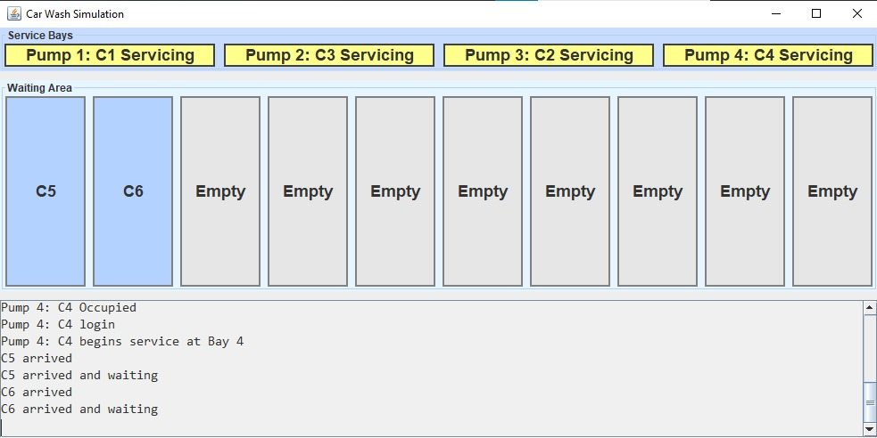
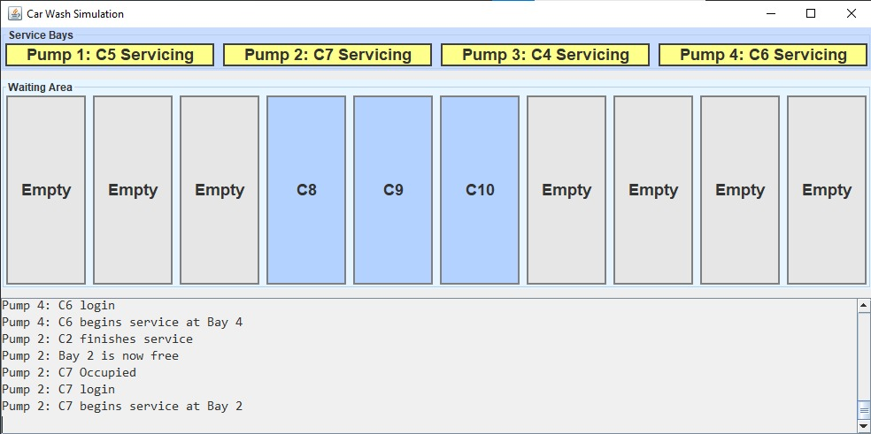
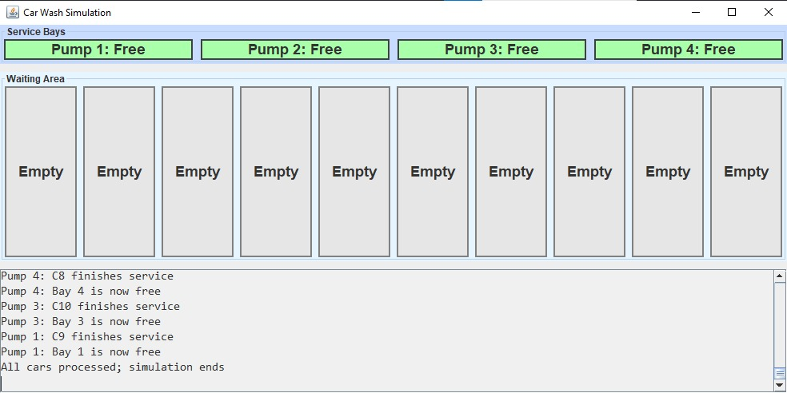

# Car Wash Simulation


A multithreaded **Car Wash & Gas Station Simulator** built in Java, implementing the classic **Producer-Consumer Problem** using the **Bounded Buffer** pattern.

The project covers custom semaphore implementation, mutex-based queue synchronization, concurrent thread management, and a live Swing GUI dashboard.

---

## Project Overview

This project demonstrates practical use of OS synchronization primitives to simulate a real-world service station. Key concepts covered include:

- **Producer-Consumer Pattern** — `Car` threads produce into a bounded queue; `Pump` threads consume from it
- **Custom Semaphore** — Implemented from scratch using `wait()` / `notify()` with `P()` and `V()` methods
- **Mutex (synchronized block)** — Prevents race conditions on shared queue access
- **Bounded Buffer** — Fixed-size waiting area enforced by `empty` and `full` semaphores
- **Thread Pool** — A fixed number of pump threads run concurrently as background consumers
- **Swing GUI** — Live color-coded dashboard showing pump status, waiting queue, and activity log

---

## Repository Structure

```
Car-Wash-Simulator/
│
├── README.md
│
├── src/
│   └── ServiceStation.java          # All classes in one file (submission format)
│
├── screenshots/                     # GUI screenshots
│   ├── servicing.jpeg
│   ├── mid_simulation.jpeg
│   └── simulation_end.jpeg
│
├── out/                             # Compiled .class files (git-ignored)
│
└── .github/
    └── workflows/
        └── build.yml                # GitHub Actions — auto-compile on every push
```

---

## Class Design

**Main Class:** `ServiceStation` — shared resources, thread orchestration, queue helpers

| Class | Role | Pattern |
|---|---|---|
| `ServiceStation` | Initializes resources, spawns threads | Main / Coordinator |
| `Semaphore` | Custom counting semaphore | `P()` / `V()` using `wait()` / `notify()` |
| `Car` | Arrives, waits for queue slot, joins queue | Producer Thread |
| `Pump` | Takes car from queue, services, releases bay | Consumer Thread |
| `CarWashGUI` | Live visual dashboard | Java Swing (`JFrame`) |

---

## Synchronization Design

**Semaphores used:**

| Semaphore | Initial Value | Purpose |
|---|---|---|
| `empty` | `waitingCapacity` | Counts available slots in the queue |
| `full` | `0` | Counts cars currently waiting in the queue |
| `pumps` | `numOfPumps` | Counts available service bays |

**Mutex:** A shared `Object mutex` guards all queue reads and writes via `synchronized` blocks.

---

## GUI Color Guide

| Color | Pump Status | Queue Slot Status |
|---|---|---|
| 🟢 Green | Bay is **Free** | — |
| 🟠 Orange | Car **Occupied** the bay | Slot has a **waiting car** |
| 🟡 Yellow | Car is actively **Servicing** | — |
| ⬜ Grey | — | Slot is **Empty** |
| 🔵 Blue | — | Slot is **occupied** by a waiting car |

---

## GUI Screenshots

**All pumps active — cars waiting in queue**



**Mid-simulation — new batch of cars waiting**



**Simulation complete — all bays free**



---

## How to Run

### Requirements
- Java 17+ ([Download JDK](https://adoptium.net/))

### Compile

```bash
mkdir -p out
javac -d out src/ServiceStation.java
```

### Run

```bash
java -cp out ServiceStation
```

### Sample Input

```
Enter garage waiting area size (1-10): 5
Enter number of pumps/service bays (at least 1): 3
Enter cars arriving (order, comma-separated): C1,C2,C3,C4,C5
```

---

## Sample Output (Without GUI)

```
C1 arrived
C2 arrived
C3 arrived
C4 arrived
Pump 1: C1 Occupied
Pump 2: C2 Occupied
Pump 3: C3 Occupied
C4 arrived and waiting
C5 arrived
C5 arrived and waiting
Pump 1: C1 login
Pump 1: C1 begins service at Bay 1
Pump 2: C2 login
Pump 2: C2 begins service at Bay 2
Pump 3: C3 login
Pump 3: C3 begins service at Bay 3
Pump 1: C1 finishes service
Pump 1: Bay 1 is now free
Pump 2: C2 finishes service
Pump 2: Bay 2 is now free
Pump 1: C4 login
Pump 1: C4 begins service at Bay 1
Pump 3: C3 finishes service
Pump 3: Bay 3 is now free
Pump 2: C5 login
Pump 2: C5 begins service at Bay 2
Pump 1: C4 finishes service
Pump 1: Bay 1 is now free
Pump 2: C5 finishes service
Pump 2: Bay 2 is now free
All cars processed; simulation ends
```

---

## Key Findings: Synchronization Behavior

The order of semaphore operations is critical to correctness:

- **Car (Producer):** must call `empty.P()` before acquiring the mutex — otherwise a full queue causes deadlock
- **Pump (Consumer):** must call `full.P()` before acquiring the mutex — otherwise an empty queue causes deadlock
- **Pump semaphore** is acquired inside the pump thread after dequeuing — this models the physical service bay constraint independently from the buffer semaphores

---

## Technologies Used

| Technology | Purpose |
|---|---|
| Java 17+ | Core language and threading (`Thread`, `synchronized`) |
| Java Swing | GUI dashboard (`JFrame`, `JLabel`, `JTextArea`) |
| GitHub Actions | Auto-compile on every push via `build.yml` |

---
